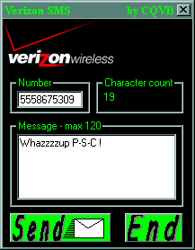



## Verizon SMS

### Description

Demonstrates using POST method for jsp servlet page. Allows user to send SMS text messages to Verizon customers' cell phone. You can actually do more from the online form i.e. track messages, and add your email as an identity. This code simply passes up all the extras and gets a simple text message to the recipient's phone. I'll try to add a little more of the online form's functionality as I learn more about how it works. Enjoy...CQVB!
 
### More Info
 
Check out this site to see what the jsp page looks like http://www.msg.myvzw.com/messaging.jsp. You can actually send to 10 users simultaneously, but as a demonstration, I set the number maxlength to only 10 characters.

Must be connected to the internet to send message.

             |
---                |---
**Submitted On**   |2001-03-29 08:38:12
**By**             |[Chris Q](https://github.com/Planet-Source-Code/PSCIndex/blob/master/ByAuthor/chris-q.md)
**Level**          |Beginner
**User Rating**    |4.6 (23 globes from 5 users)
**Compatibility**  |VB 6\.0
**Category**       |[Internet/ HTML](https://github.com/Planet-Source-Code/PSCIndex/blob/master/ByCategory/internet-html__1-34.md)
**World**          |[Visual Basic](https://github.com/Planet-Source-Code/PSCIndex/blob/master/ByWorld/visual-basic.md)
**Archive File**   |[CODE\_UPLOAD176933292001\.zip](https://github.com/Planet-Source-Code/chris-q-verizon-sms__1-22011/archive/master.zip)

